# Student Management System

## 1. Introduction

The Student Management System is a Django-based web application designed to manage student profiles and their academic data efficiently. 
This system allows users to perform CRUD (Create, Read, Update, Delete) operations on student information, manage their academic history including courses, grades, and exam scores. 
The purpose of this project is to streamline the management of student information and academic records in educational institutions.

## 2. System Architecture

The Student Management System is built using Django, a high-level Python web framework. The project architecture includes the following components:

- **Django Framework**: Backend framework for managing the application logic.
- **PostgreSQL**: Database for development purposes.
- **HTML, CSS, JavaScript, jQuery**: Frontend technologies for building the user interface.
- **Django Templates**: For rendering HTML pages.

## 3. Functional Requirements

### Authentication

- User login and logout functionalities.
- Only authenticated users can access and manage student profiles and academic data.

### Student App

- **CRUD Operations**: Create, read, update, and delete student information.
- **Academic Management**: Manage student enrollments, courses, grades, and exam scores.
- **Instructor Management**: Manage instructors of courses.

### Search and Filters

- Implement search functionality to find students by name and email; courses by name and code;
and instructors by name and email.
- Filters to narrow down the list of students and instructors based on specific courses.

## 4. Database Schema

- **Student**: Fields: `first_name`, `last_name`, `email`, `date_of_birth`
- **Course**: Fields: `course_name`, `course_code`, `description`
- **Instructor**: Fields: `first_name`, `last_name`, `email`, `courses` (Many-to-Many relationship with Course)
- **Enrollment**: Fields: `student` (ForeignKey to Student), `course` (ForeignKey to Course), `grade`, `exam_score`

### Tables

- `student`
- `course`
- `instructor`
- `enrollment`

## 5. User Interface Design

### Screenshots and Navigation

1. **Authentication**: Home and login page.
   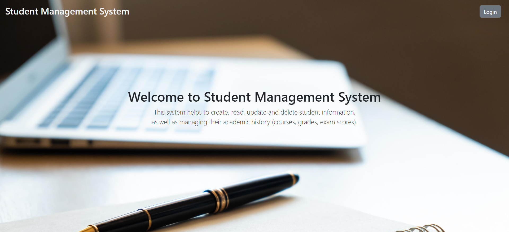
   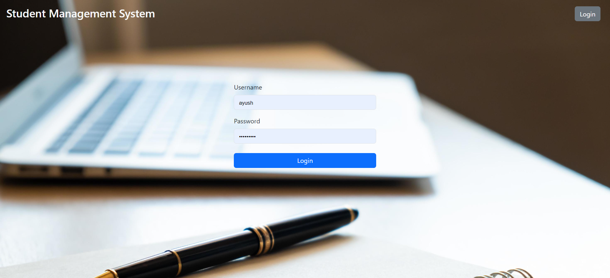

2. **Student List**: Lists all students with options to view, edit, or delete.
   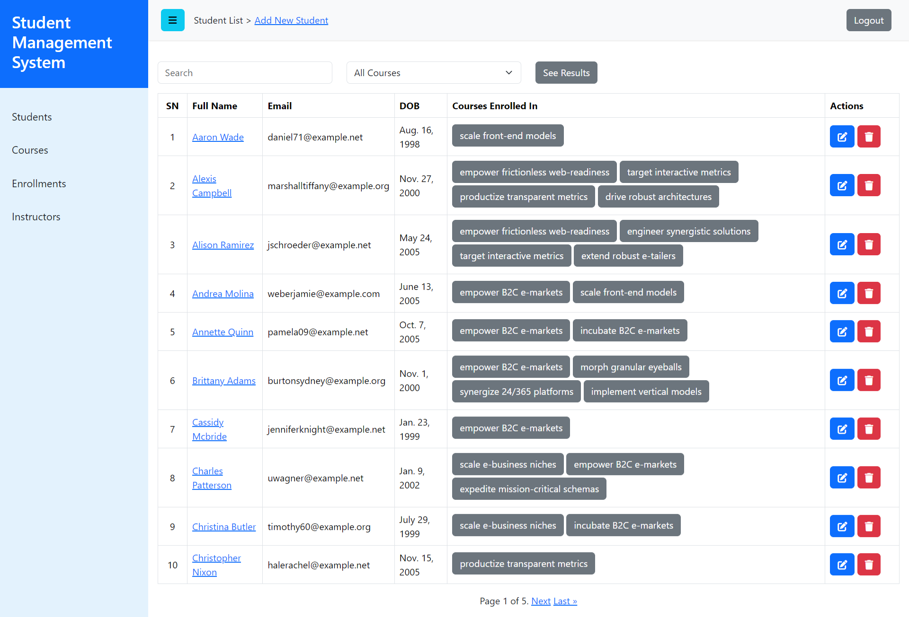

3. **Student Detail**: Displays detailed information about a student along with their enrollments, grade and exam score.
   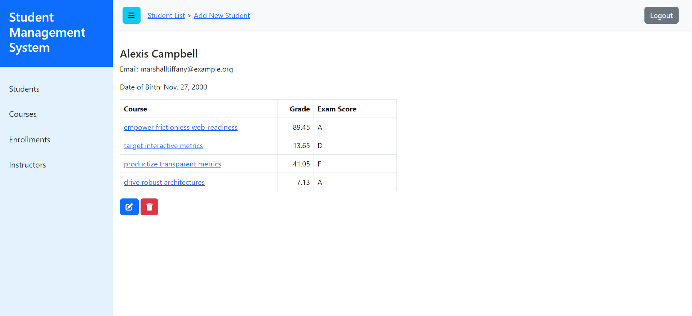

4. **Add/Edit Student**: Form for adding a new student or editing an existing student's information.
   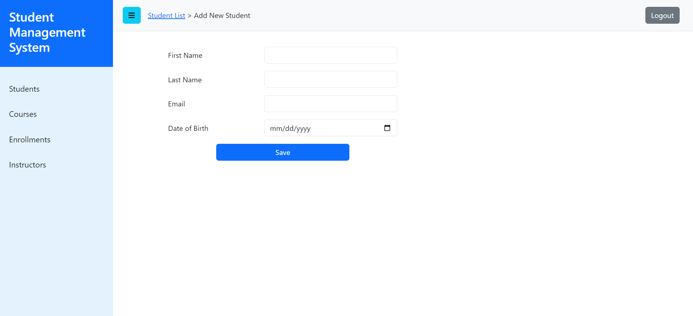

5. **Course List**: Lists all courses with options to view, edit, or delete.
   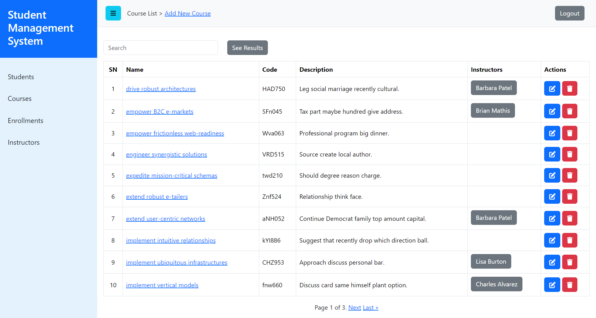

6. **Add/Edit Course**: Form for adding a new course or editing an existing course information.
   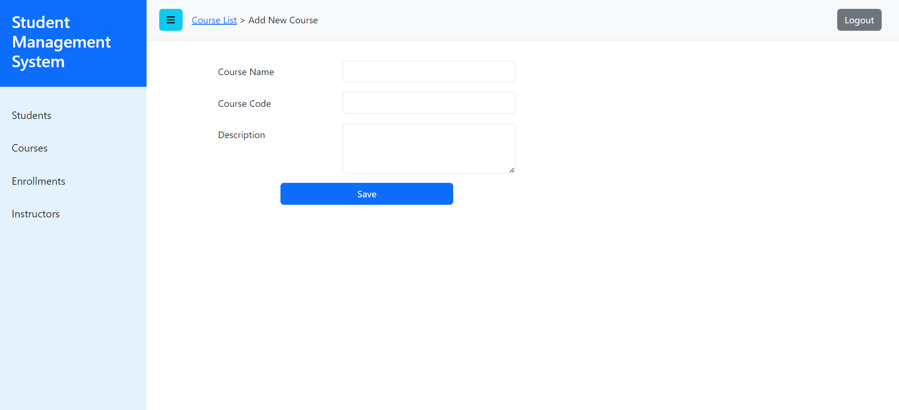

7. **Enrollment List**: Lists all enrollments with options to view, edit, or delete.
   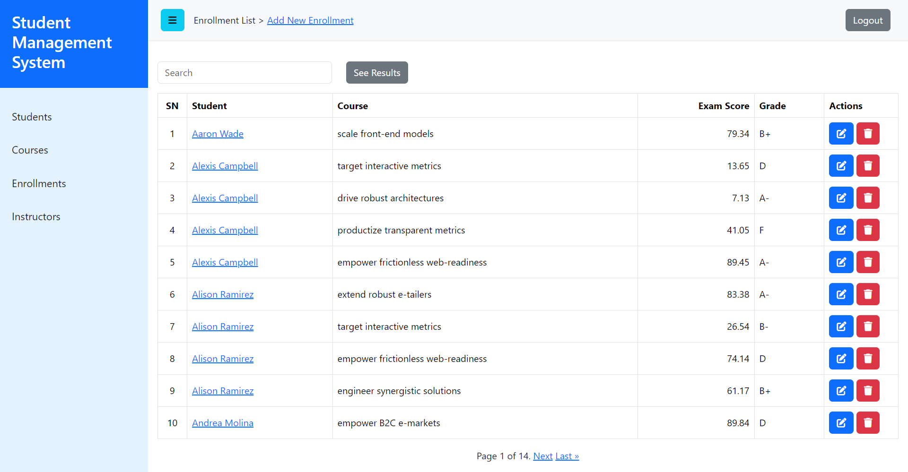

8. **Add/Edit Enrollment**: Form for adding a new enrollment or editing an existing enrollment information.
   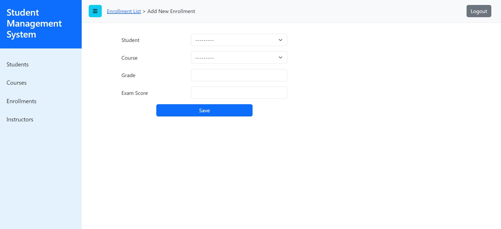

9. **Instructor List**: Lists all instructors with options to view, edit, or delete.
   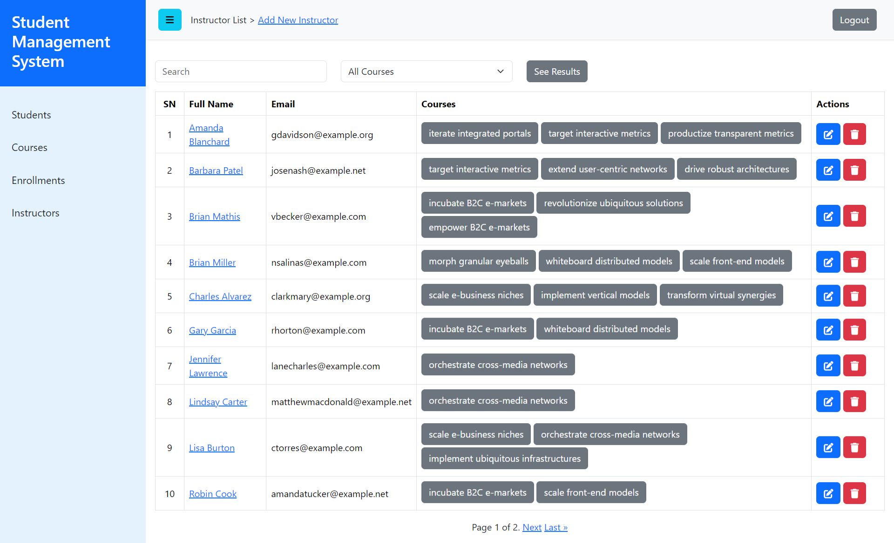

10. **Add/Edit Instructor**: Form for adding a new instructor or editing an existing instructor's information.
    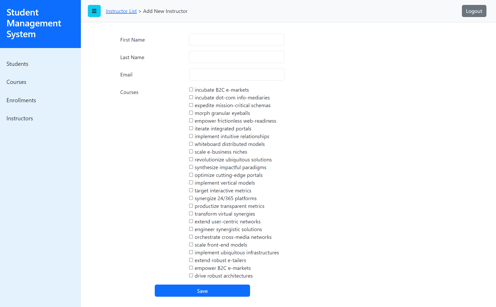

## 6. Deployment

### Using Virtual Environment

1. **Create a virtual environment**:

   `python -m venv venv`

2. **Setup PostgreSQL database and use the parameters from the provided 
environment file `env_local.env` or create new one according to `env_example.env`**

3. **Activate the virtual environment**:

   `venv\Scripts\activate`

###Installations

1. **Install all dependencies from `requirement.txt`**:

   `pip install -r requirement.txt`

2. **Apply migrations to set up the database**:

   `python manage.py migrate`

3. **Create a superuser for accessing the application**:

   `python manage.py createsuperuser`

###Configurations

1. **Run the development server**:

   `python manage.py runserver`

2. **Access the application**:
   - Open your web browser and navigate to `http://127.0.0.1:8000/`.
   - Use the `username` and `password` of the superuser.
   
3. **Populate the database with realistic dummy data**:

   `python manage.py populate_dummy_data`

This README provides an overview of the Student Management System, 
covering its purpose, architecture, functional requirements, 
database schema, user interface, and deployment instructions.